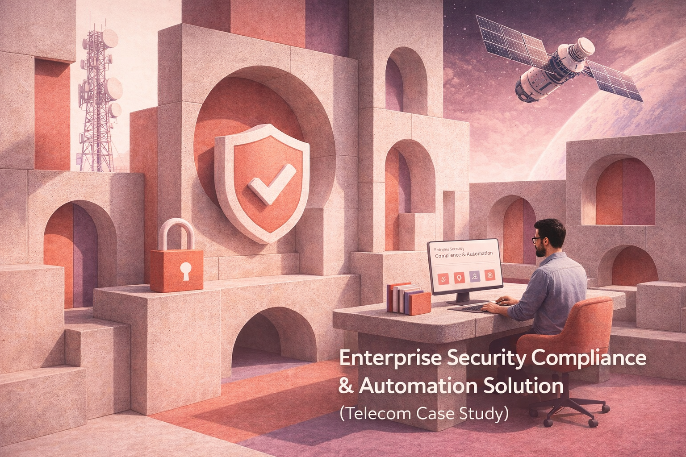

# Enterprise Security Compliance Monitoring & Automation Solution *(Telecom Case Study)*

## Overview
This project showcases an enterprise-grade security compliance and automation platform designed for a large telecom organization operating across multiple regions and states.
The solution centralizes endpoint security visibility, automates remediation workflows, introduces AI-powered incident intelligence, and delivers a generative AI chatbot to improve security operations and user awareness.
It demonstrates how Microsoft Power Platform tools can be combined to build a scalable, end-to-end enterprise solution.
 

---

## Business Context
The organization manages hundreds of systems and relies on multiple security solutions to protect its infrastructure, including endpoint protection, data loss prevention, asset inventory, patch management, and system encryption tools. 
An internal audit revealed findings leading to visibility gaps, delayed remediation, and increased security risk. 
- Inconsistent deployment of security agents across systems
- Fragmented reporting across multiple security tools  
- Manual and delayed remediation follow-ups with non-compliant users 
- Limited real-time compliance visibility  
- No centralized view of enterprise-wide security compliance
- Lack of automated escalation and remediation tracking
- Limited user awareness and self-service security support 

---

## Solution Architecture (High Level)

The platform was designed across four major layers:

1. **Analytics & Compliance Monitoring**  
   Power BI and Excel dashboards provide real-time security compliance visibility.
2. **Automation & Remediation**  
   Power Apps and Power Automate workflows for notifications, escalations, and remediation tracking.
3. **AI & Incident Intelligence**  
   AI Builder solutions for extracting, structuring, and analyzing security incident data.
4. **Generative AI & Self-Service**  
   Smart chatbot integrated with Teams and email to support users and improve awareness.

---

## Core Solution Modules

### 📊 Security Compliance Analytics (Excel & Power BI)
An interactive dashboard was designed to provide real-time visibility into security compliance status.

**Key Features:**
- Monthly compliance filtering  
- Total asset count  
- Compliance & non-compliance percentages per security solution  
- Overall enterprise compliance score  
- Geo-compliance map across Nigeria  
- Top states, regions, and departments by compliance level  
- Executive-ready insights for decision-making
  
➡ See full module: **/02-powerbi-excel**

---

### Section B: Power Platform Automation (Power Apps & Power Automate)
A remediation and notification workflow was built to proactively manage non-compliant systems.

**Key Capabilities:**
- Automated email and Microsoft Teams notifications to users  
- Clear identification of missing security agents  
- Escalation to line managers and IT support teams  
- Automated reminders every 2 days until remediation  
- User-triggered remediation confirmation  
- Security team validation workflow  
<Button>PowerApps<Button/>  Link to the folder enterprise-security-compliance-power-platform/03- Power Platform Automation (Power Apps & Power Automate)
---

### Section C: AI-Powered Information Security Chatbot
A generative AI chatbot was developed to support user awareness and self-service.

**Features:**
- Internet-enabled and local knowledge base integration  
- Microsoft Teams and Outlook integration  
- Post-conversation email summary to users  
- Embedded chatbot access link for follow-up questions  
<Button>Chatbot<Button/>  Link to the folder enterprise-security-compliance-power-platform/04- AI-Powered Information Security Chatbot

---

### Section D: Incident Email Intelligence (AI Builder)
AI Builder was used to extract structured incident data from security alert emails.

**Outcomes:**
- Automated extraction of incident details  
- Structured storage in SharePoint-hosted Excel  
- Daily 4pm consolidated incident report to security teams  
<Button>AI builder<Button/>  Link to the folder enterprise-security-compliance-power-platform/05- Incident Email Intelligence (AI Builder)

---

### Section E: Security Awareness & Education
A short executive-friendly awareness presentation was designed highlighting:
- Risks associated with deepfake technology  
- WhatsApp-based social engineering threats  
- Practical mitigation strategies  
<Button>Aareness<Button/>  Link to the folder enterprise-security-compliance-power-platform/06- Security Awareness & Education

---

## Tools & Technologies
- Microsoft Power BI  
- Microsoft Excel  
- Power Apps  
- Power Automate  
- AI Builder  
- SharePoint Online  
- Microsoft Teams  
- Outlook  
- Autonomous Copilot Agent  

---

## Key Outcomes
- Centralized visibility of enterprise security posture  
- Reduced remediation response time through automation  
- Improved security awareness across users  
- Scalable and enterprise-ready Power Platform solution  

---

## Disclaimer
This project is a technical case study created for assessment and portfolio demonstration purposes. 
All data used is either simulated or anonymized.
